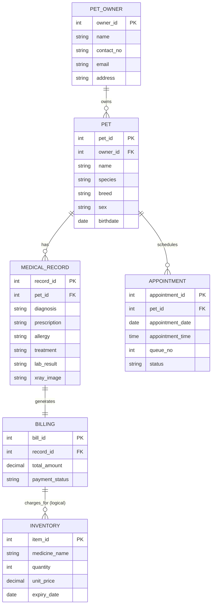
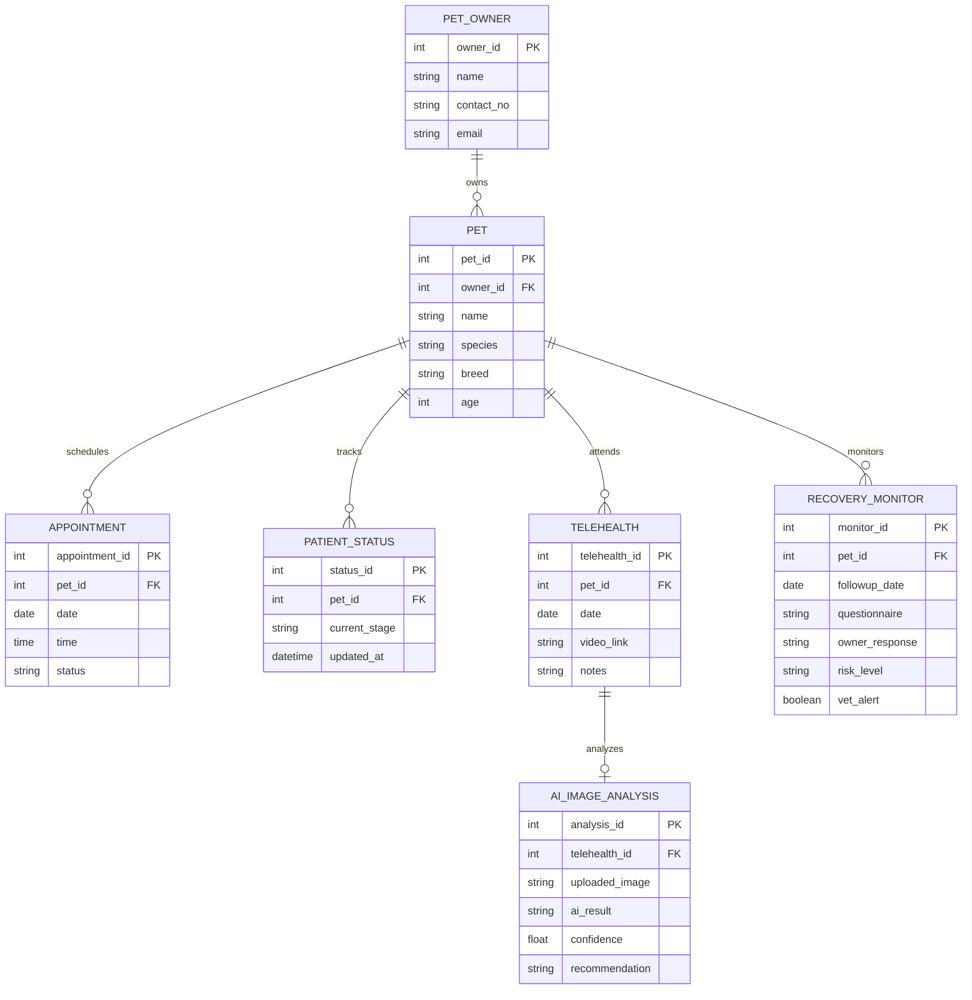
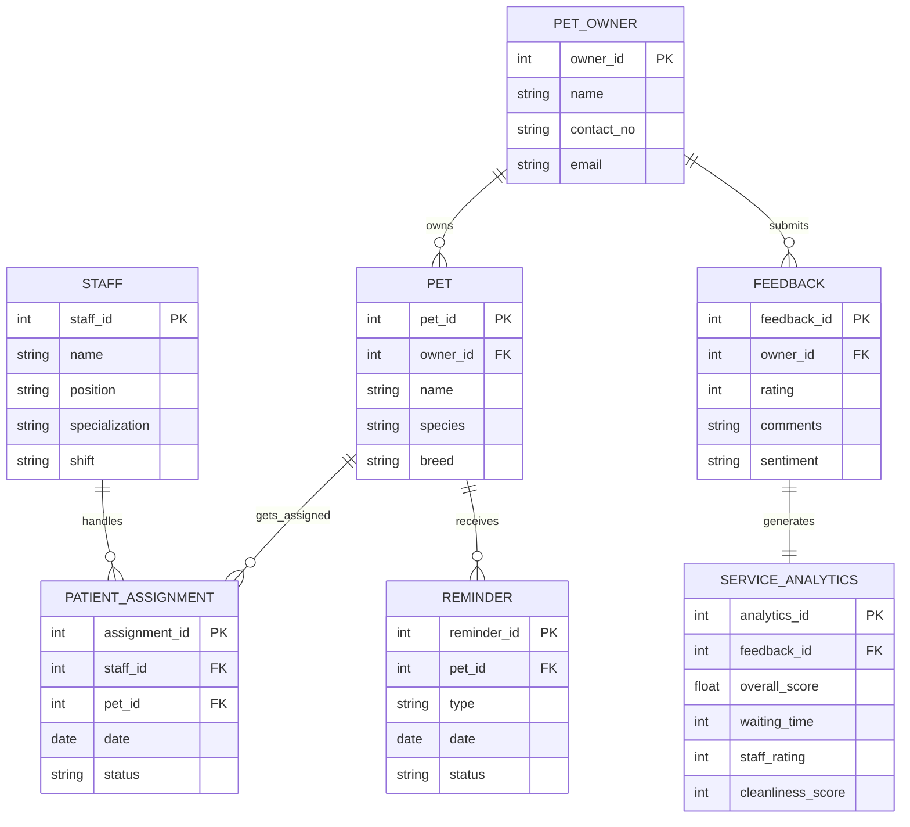

# Veterinary Systems ER Diagrams

This document contains visual Entity-Relationship Diagrams (ERDs) and schema mappings for three distinct veterinary clinic platforms. The diagrams are generated using Mermaid.js syntax for clear rendering and structural analysis.

---

## 1. Integrated Veterinary Clinic Management and Patient Care System (IVCMPS)

The **IVCMPS** is structured around clinical workflows, patient care histories, medical records, billing, and inventory tracking.

### Mermaid ERD

### Relationship Details & Cardinality
*   **PET_OWNER (1) ── owns ── (Many) PET**: An owner can register and own multiple pets. A pet belongs to exactly one owner.
*   **PET (1) ── has ── (Many) MEDICAL_RECORD**: Over time, a pet can accumulate multiple medical visit records.
*   **PET (1) ── schedules ── (Many) APPOINTMENT**: A pet can have multiple appointments scheduled over its lifecycle.
*   **MEDICAL_RECORD (1) ── generates ── (1) BILLING**: Each medical visit record generates exactly one billing transaction.
*   **BILLING (Many) ── charges_for ── (Many) INVENTORY (Logical)**:
    > [!TIP]
    > **Normalization Suggestion:** To link billing with inventory properly, introduce a junction/bridge table:
    > **BILL_ITEM** (`bill_item_id` [PK], `bill_id` [FK], `item_id` [FK], `quantity_billed`, `price_at_sale`). This avoids a direct un-normalized link.

---

## 2. VetiCare – Smart Clinic Platform for Real-Time Tracking & Telehealth

**VetiCare** is designed for real-time scheduling, patient flow tracking, telehealth sessions, AI image analysis, and post-consultation recovery monitoring.

### Mermaid ERD

### Relationship Details & Cardinality
*   **PET_OWNER (1) ── owns ── (Many) PET**: Standard ownership link.
*   **PET (1) ── tracks ── (Many) PATIENT_STATUS**: Tracks real-time clinical stages (e.g., Checked-In, In-Triage, With Doctor, Discharged).
*   **PET (1) ── attends ── (Many) TELEHEALTH**: Telehealth sessions associated with a specific pet.
*   **TELEHEALTH (1) ── analyzes ── (0 or 1) AI_IMAGE_ANALYSIS**: A telehealth session may optionally have a pet image uploaded and processed by the AI system.
*   **PET (1) ── monitors ── (Many) RECOVERY_MONITOR**: Recovery monitoring forms assigned to track follow-up progress.
    > [!NOTE]
    > **Workflow Note:** While the recovery monitoring logic is triggered by AI recommendations, the record is directly associated with the `PET` via `pet_id` to maintain patient history.

---

## 3. VetStream – Centralized Veterinary Operations & Client Engagement

**VetStream** focuses on clinic operations, staff shift schedules, automated patient assignments, and customer feedback loops with satisfaction analytics.

### Mermaid ERD

### Relationship Details & Cardinality
*   **STAFF (1) ── handles ── (Many) PATIENT_ASSIGNMENT**: A staff member can be assigned to multiple patient care tasks.
*   **PET (1) ── gets_assigned ── (Many) PATIENT_ASSIGNMENT**: A pet can be assigned to staff members for care.
    *   *Note:* `PATIENT_ASSIGNMENT` serves as a many-to-many bridge table between `STAFF` and `PET`.
*   **PET_OWNER (1) ── owns ── (Many) PET**: Ownership relationship mapping.
*   **PET_OWNER (1) ── submits ── (Many) FEEDBACK**: Feedback is linked directly to the owner submitting it (`owner_id` is foreign key in `FEEDBACK`).
*   **PET (1) ── receives ── (Many) REMINDER**: Reminders (e.g., vaccine boosters, check-ups) target a specific pet.
*   **FEEDBACK (1) ── generates ── (1) SERVICE_ANALYTICS**: Customer feedback feeds into operations analytics for reporting.
